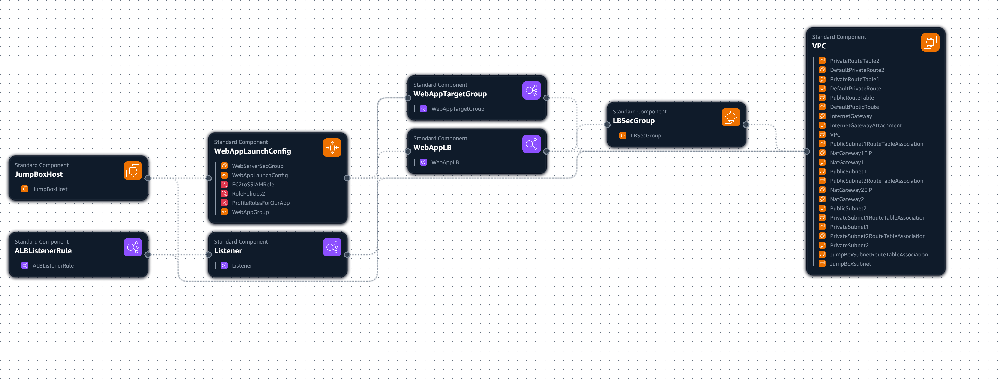

# AWS Infrastructure Documentation

**Trainee Name: Yasser Ahmed**  
**Group: 6 May 2025**  

## Table of Contents

1. [1-Overview](#1--overview)
2. [Architecture Components](#architecture-components)
3. [Network Infrastructure](#network-infrastructure)
4. [Networking Components](#networking-components)
5. [Data Flow](#data-flow)
6. [High Availability Features](#high-availability-features)

## 1- Overview
This document describes the AWS infrastructure design for Udagram, an Instagram clone application. The architecture follows AWS best practices for high availability, scalability, and security.

## Architecture Components

### Network Infrastructure
- **Virtual Private Cloud (VPC)**: The application runs within a custom VPC providing network isolation.
- **Availability Zones**: The system spans two availability zones (AZ1 and AZ2) for fault tolerance.
- **Subnets**:
  - Public Subnet 1 (AZ1)
  - Public Subnet 2 (AZ2)
  - Private Subnet 1 (AZ1)
  - Private Subnet 2 (AZ2)

### Networking Components
- **Internet Gateway**: Provides internet access for resources in public subnets.
- **NAT Gateways**: Two instances (one per AZ) allow outbound internet access for private subnet resources.
- **Elastic IP Addresses**: Two addresses associated with the NAT Gateways.
- **Route Tables**:
  - Public route table for public subnets
  - Private route tables (one per AZ) for private subnets

### Compute Resources
- **Auto Scaling**: Enables automatic scaling of compute resources based on demand.
- **Application Load Balancer**: Distributes incoming traffic across instances in multiple AZs.

### Storage
- **S3 Bucket**: Named "udagram-124175602655-bucket" for storing application assets.

### Security
- **Security Groups**: Multiple security groups implement network-level access control.
  - One for the Udagram application
  - One for developers' access

## Data Flow
1. User requests enter through the Application Load Balancer
2. Traffic is distributed to instances in public subnets
3. Application instances in private subnets process requests
4. NAT Gateways provide internet access for private instances
5. S3 bucket stores and serves media content

## High Availability Features
- Multi-AZ deployment (AZ1 and AZ2)
- Auto Scaling for horizontal scaling
- Load balanced traffic distribution
- Redundant NAT Gateways (one per AZ)
